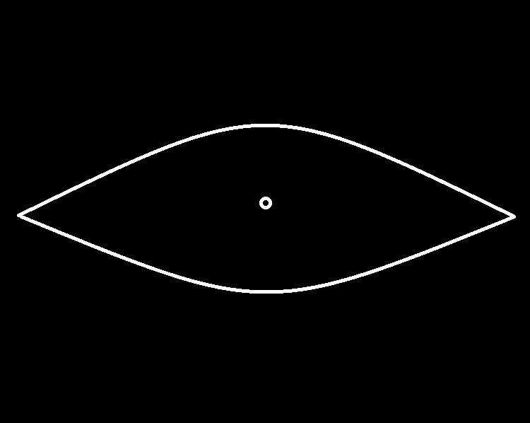
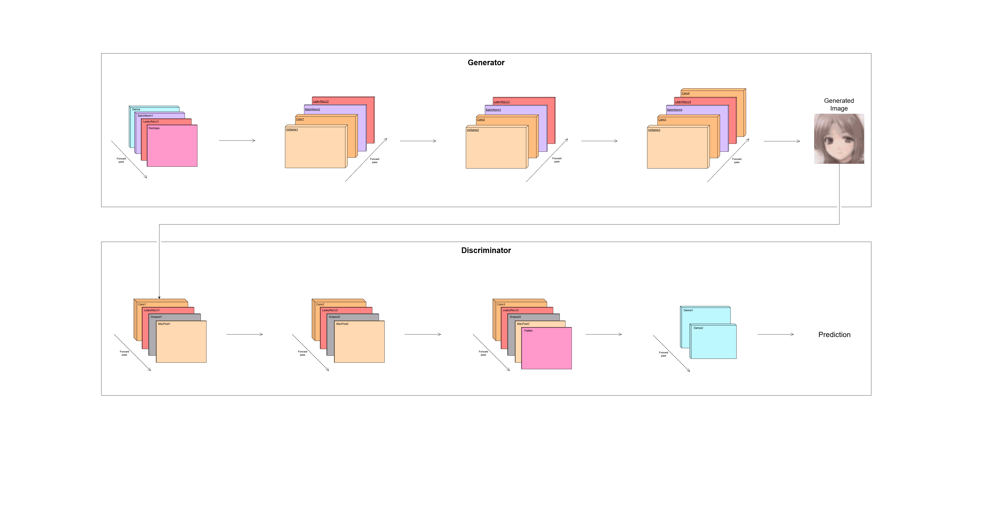

# GENERATIVE MODEL SERIES: ESKIZ 
<div style="position: absolute; top: 0; right: 0; padding: 10px; padding-right: 55px;"> 
   
</div>

**Eskiz** is an experimental generative model based on the **Deep Convolutional Generative Adversarial Network** architecture. 

The project was built for exploring neural network behaviour in latent space.

Check Video: magicURL


## About the Project

This is the start project with the first serie model:
- **Model Name**: Eskiz
- **Version**: B.E.1.0
- **Type**: Deep Convolutional Generative Adversarial Network


## Architecture

The Deep Convolutional Generative Adversarial Network consists of two interconnected models - **generator** and **discriminator**. The complete forward pass diagram of the neural network is show below:




## Latent Space Walk

The GIF below shows a smooth transition through the latent space.

<div style="padding: 10px; align: center;">
  
</div>

<br>

Each frame is generated by the same model, with the noise vector slightly shifted step by step.


## Why this project matters

Understanding the latent space is essential for building interpretable generative models.
This project documents the first steps of that exploration - including both successes and irregularities.

The results show that a small‑scale DCGAN model can produce meaningful images. The experiments reveal the internal structure of the latent space and the logic behind the generations.


## Further Exploration

**This project is a starting point - not a finished one!**

### You are invited to:

- Load the trained weights and walk through the latent space yourself.

- Modify the architecture - try different layer sizes, activation functions, or loss functions formulations.

- Train your own version of Eskiz on a different dataset and compare the results.

- Experiment with the interpolation logic and observe how the model behaves at different points in the latent space.

## Getting Started

**1. Clone the repository:**
```bash
git clone https://github.com/Ahojman-Dev/Eskiz.git
cd Eskiz
```

<br>

All **ipynb** files with the code are located in the directory **"code"**. There are two files:
- **Eskiz_train.ipynb:** The file with the complete process of initialization and training of the model.
- **Eskiz_evaluation.ipynb:** The file with experimental evaluation of the trained model.

All trained **models weights** are located in the directory **"weights"**. There are 3 weights:
- **best_gan_weights.h5**: File of the latest best weights of the model at the time of its publication.
- **horror_gan_weights_v2_1.h5**: The model weight file at the time of the first mode collapse during the training process.
- **horror_gan_weights_v2_2.h5**: The model weight file at the time of the second mode collapse during the training process.

<br>

**2. Running the code with one button:**

To get started, use the **Google Collaboratory service** - open the file with code and start a session with the **T4 processor**, upload one of the provided files with the weights of the already trained model. After completing the steps above, **run all cells** in the notebook.


## License

Apache License 2.0